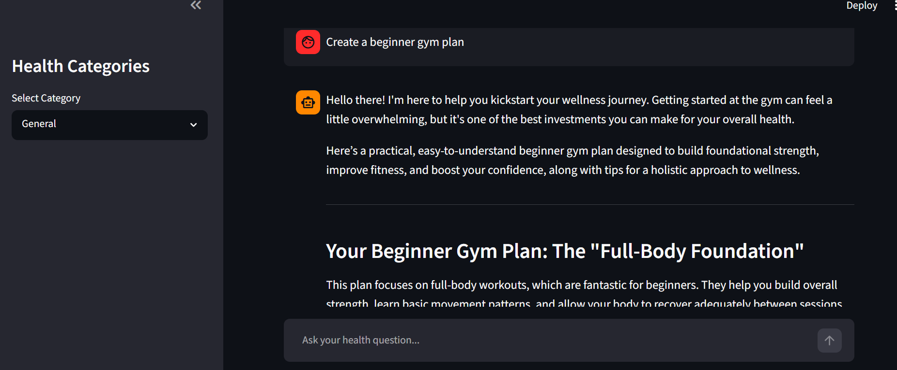

# AI Wellness Agent Pro

AI Wellness Agent Pro is an AI-powered health and wellness assistant built using Python, Streamlit, and Google Gemini API. The application helps users receive personalized wellness recommendations, generate wellness reports, and interact with an AI health assistant.

## Features

* AI Wellness Chat Assistant
* BMI Calculator
* Daily Calorie Calculator
* Wellness Dashboard
* Wellness Score Tracking
* AI Wellness Report Generator
* Personalized 7-Day Wellness Plan
* Sleep Improvement Guidance
* Fitness Recommendations
* Nutrition Advice
* Stress Management Support
* Conversation Memory
* Category-Based Health Assistance
* Interactive Streamlit Interface
* Google Gemini AI Integration


## Tech Stack

* Python
* Streamlit
* Google Gemini API
* python-dotenv

## Project Structure

AI-Wellness-Agent/

├── app.py

├── README.md

├── requirements.txt

├── .gitignore

└── screenshots/

    └── app.png

## Installation

### Clone Repository

```bash
git clone https://github.com/Deepakguptaaa/AI-Wellness-Agent.git
cd AI-Wellness-Agent
```

### Create Virtual Environment

```bash
python -m venv venv
```

### Activate Virtual Environment

Windows:

```bash
venv\Scripts\activate
```

### Install Dependencies

```bash
pip install -r requirements.txt
```

### Configure API Key

Create a `.env` file:

```env
GEMINI_API_KEY=YOUR_API_KEY
```

### Run Application

```bash
streamlit run app.py
```

## Screenshots

Application Interface:



## Future Enhancements

* User Authentication
* Voice-Based Interaction
* Health Data Visualization
* PDF Wellness Report Export
* Personalized Goal Tracking
* Mobile Application Version


## Learning Outcomes

This project demonstrates:

* Generative AI Integration
* Prompt Engineering
* Streamlit Application Development
* API Integration
* AI-Powered User Assistance

## Author

Deepak Gupta

B.Tech (AI/ML)

Aspiring AI/ML Engineer | Generative AI Enthusiast
